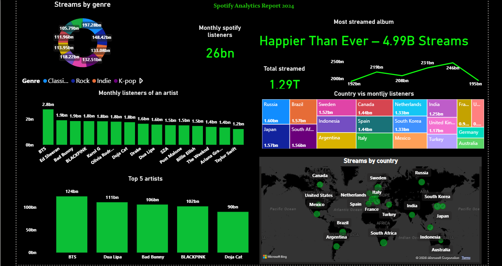

# Spotify Streaming Analytics Dashboard (Power BI)

## Objective
To analyze global music streaming data and identify trends in song popularity, artist performance, and listener behavior using Power BI.

## Key KPIs
- Total Streams
- Top Artists
- Top Tracks
- Streams by Region

## Analysis Performed
- Artist-wise and track-wise popularity analysis
- Genre-based and regional streaming trends
- Time-based streaming performance analysis
- Identification of top-performing songs and artists

## Tools & Technologies
- Power BI
- DAX
- Microsoft Excel

## Dataset
Spotify Global Streaming Dataset (publicly available)

## Notes
The interactive dashboard is available in the PBIX file.
